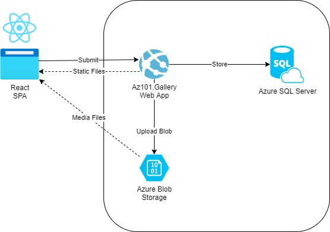

# AZ-101

The Azure fundamentals course for Rookies.

## Prerequisite

1. NodeJS >= 14
2. .NET 5
3. Azure Subscription

## Deployment

1. Azure App Service to deploy Az101.Gallery application
2. SQL Server
3. Azure Blob Storage (Public Access - Blob Level)

## Diagram

